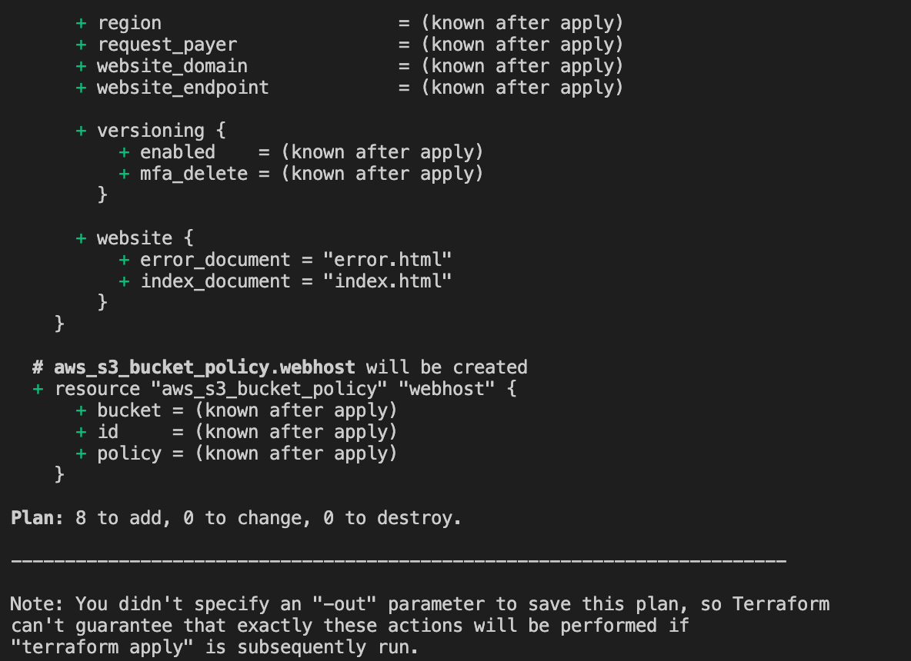

# Using terraform to create AWS resources

First of all you have to own a registered domain that you will use to your url shortener.

As a pre-requirement to use this terraform, you have to create a hosted zone using **AWS Route 53** manually and configure DNS servers on your registrar.

After that, terraform will do all the magic.

<p align="center">

</p>

We are working to improve this terraform module and soon you won't need to create the DNS zone manually.

## Variables

Required variables:

"aws_profile". type = string # A AWS named profile with access keys configured in your local machine. If you don't know what is this and how to configure it, follow [this guide](https://docs.aws.amazon.com/cli/latest/userguide/cli-configure-profiles.html). 

"domain_name".  type = string # Your registered domain. It will be your web hosting bucket as well.

"logs_bucket". type = string # Bucket name to store cloudfront logs. It's recommend use another bucket instead of the last one.

## How to

1. Install terraform on your local machine. [Download](https://www.terraform.io/downloads.html)

2. With terraform installed, open your terminal, go to terraform folder inside your cloned local repository.

3. Then run the following command

```bash
$ terraform plan
```

It will ask you all required variables. After that, if goes good, will generate and show an execution plan.



4. After your analis, you can finally apply the execution plan running the following command:

```bash
$ terraform apply
```

It will ask you to confirm, writing "Yes". This is the only word accepted to begin running.

The execution will take between 15-30 min because the process of propagtion of DNS and Cloudfront.

## FAQ

Q. I'm getting the following error when i'm running terraform plan or apply. "Error: no matching Route53Zone found". What is going on?

A. This error is happening because you need to have the domain DNS zone created on your AWS account, the one configured in your named profile. 
**Don't forget to have domain registered and DNS servers configured in the registrar.**

